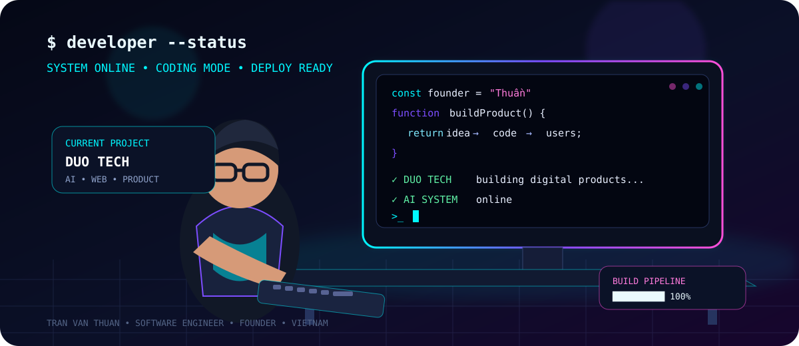
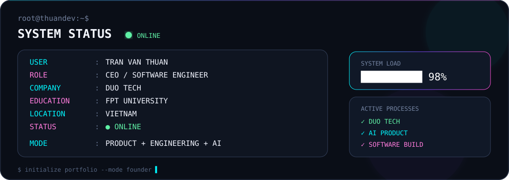

<div align="center">

# ⚡ TRẦN VĂN THUẦN // SYSTEM ONLINE

### CEO & Founder @ DUO TECH
### Software Engineer • Full-stack Developer • AI Product Builder


<br />

<a href="https://github.com/Tranvanthuan1805"></a>
<a href="https://www.youtube.com/@Tran_Van_Thuan"></a>
<a href="https://www.facebook.com/tran.van.thuan.499718"></a>

</div>

---

<div align="center">

</div>

---

## 🖥️ SYSTEM STATUS

<div align="center">

</div>

---

## 👨‍💻 ABOUT ME

I'm **Trần Văn Thuần**, a Software Engineering student at **FPT University** and the **CEO & Founder of DUO TECH**.

I build software products by connecting **engineering, product thinking, AI and business** — from the first idea to architecture, development and deployment.

- 🎓 Software Engineering @ FPT University
- 🏆 Top 10% Scholarship
- 🏢 CEO & Founder @ **DUO TECH**
- 🚀 Founder of **Thuần Lại Lập Trình**
- 👥 Built a 1,000+ member learning community
- 🤖 Interested in AI-powered products and automation
- 💻 Focused on practical, production-ready software

<div align="center">


</div>

---

## 🏢 DUO TECH

### Technology • Software • AI • Digital Products

At **DUO TECH**, I work on turning business ideas into real software systems.

```text
🌐 Web Applications
🤖 AI-powered Systems
🏗️ Management Platforms
🎓 Educational Technology
⚙️ Custom Software
🚀 Digital Products
```

**My role:** `CEO` `Product` `Technology` `Architecture` `Engineering`

> Building a company is not only about writing code — it's about solving the right problem with the right system.

---

## ⚙️ TECH STACK

### Languages

     

### Frontend

    

### Backend & Database

     

### Tools & Cloud

    

---

## 🚀 FEATURED PROJECTS

### 🎓 EZ LUYỆN THI
Educational practice platform focused on interactive learning and exam preparation.

`Education` `Web Platform` `AI` `Product`

### 🏗️ MASTER HOUSING
Construction ecosystem and project management platform integrating digital workflows and AI-powered capabilities.

`Construction` `Management System` `AI` `Web Application`

### 💡 DUO TECH PROJECTS
Custom software systems for businesses, including web platforms, management systems, educational products and AI integrations.

`Custom Software` `Business Solutions` `AI Integration`

---

## 📊 GITHUB ANALYTICS

<div align="center">


<br /><br />

</div>

---

## 🏆 ACHIEVEMENTS

<div align="center">

</div>

---

## 🧠 CURRENT MISSION

```text
[████████████████████████████████████████] ONLINE

01  BUILD SOFTWARE PRODUCTS
02  EXPLORE AI & AUTOMATION
03  SCALE DUO TECH
04  IMPROVE SOFTWARE ARCHITECTURE
05  SHARE KNOWLEDGE
06  BUILD FROM 0 → 1

STATUS: BUILDING...
```

---

## 📈 CONTRIBUTION GRAPH

<div align="center">

</div>

---

## 📺 YOUTUBE

<div align="center">

### Coding • Software Engineering • AI • Building Products

<a href="https://www.youtube.com/@Tran_Van_Thuan">

</a>

</div>

---

## 🌐 CONNECT WITH ME

<div align="center">
<a href="https://github.com/Tranvanthuan1805">GitHub</a> •
<a href="https://www.youtube.com/@Tran_Van_Thuan">YouTube</a> •
<a href="https://www.facebook.com/tran.van.thuan.499718">Facebook</a>

<br /><br />

### Let's build something meaningful.


<br /><br />

`SYSTEM ONLINE • KEEP BUILDING • KEEP LEARNING • KEEP SHIPPING`
</div>
