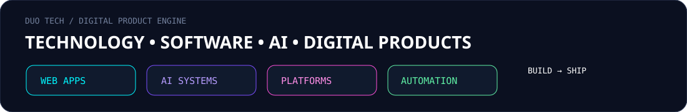
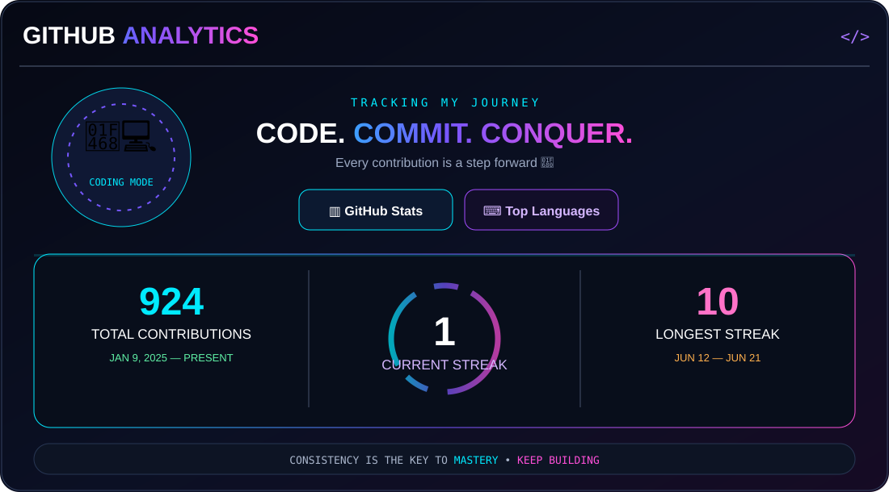
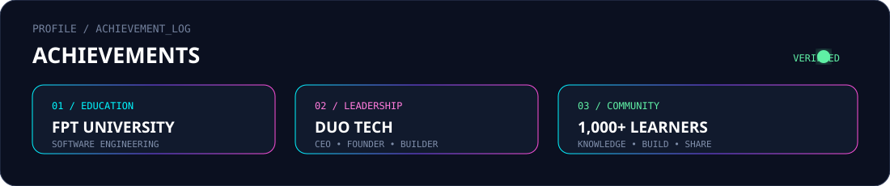

# ⚡ TRẦN VĂN THUẦN

### CEO & Founder @ DUO TECH
### Software Engineer • Full-stack Developer • AI Product Builder

---

## 🖥️ SYSTEM STATUS

---

## 👨‍💻 ABOUT ME
I'm **Trần Văn Thuần**, a Software Engineering student at **FPT University** and the **CEO & Founder of DUO TECH**.

I build software products by connecting **engineering, product thinking, AI and business** — from the first idea to architecture, development and deployment.

- 🎓 Software Engineering @ FPT University
- 🏆 Top 10% Scholarship
- 🏢 CEO & Founder @ **DUO TECH**
- 🚀 Founder of **Thuần Lại Lập Trình**
- 👥 Built a 1,000+ member learning community
- 🤖 Interested in AI-powered products and automation
- 💻 Focused on practical, production-ready software

---

## 🏢 DUO TECH

At **DUO TECH**, I work on turning business ideas into real software systems.

**My role:** `CEO` `Product` `Technology` `Architecture` `Engineering`

> Building a company is not only about writing code — it's about solving the right problem with the right system.

---

## ⚙️ TECH STACK

  

---

## 🚀 FEATURED PROJECTS

<table><tr>
<td width="33%" align="center"><h3>🎓 EZ LUYỆN THI</h3>
Interactive educational practice platform for students and exam preparation.
<code>EDUCATION</code> <code>AI</code></td>
<td width="33%" align="center"><h3>🏗️ MASTER HOUSING</h3>
Construction ecosystem and project management platform with AI capabilities.
<code>CONSTRUCTION</code> <code>AI</code></td>
<td width="33%" align="center"><h3>💡 DUO TECH</h3>
Custom software, management systems, digital products and AI integrations.
<code>SOFTWARE</code> <code>PRODUCT</code></td>
</tr></table>

---

## 📊 GITHUB ANALYTICS

---

## 🏆 ACHIEVEMENTS

---

## ✨ HIGHLIGHTS

 

---

## 🧠 CURRENT MISSION

---

## 📺 YOUTUBE

 

---

## 🌐 CONNECT WITH ME

<a href="https://github.com/Tranvanthuan1805">GitHub</a> • <a href="https://www.youtube.com/@Tran_Van_Thuan">YouTube</a> • <a href="https://www.facebook.com/tran.van.thuan.499718">Facebook</a>   

